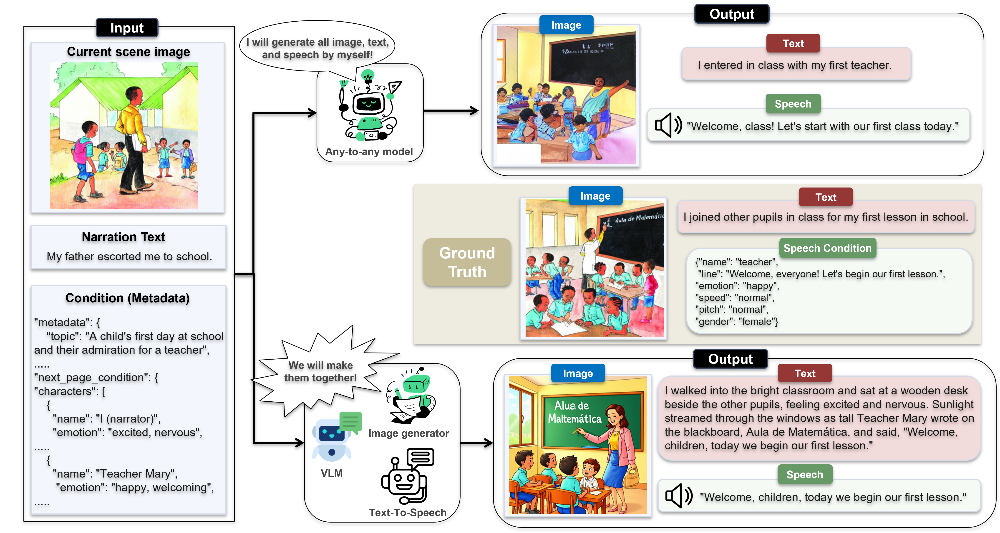

<h1 align="center">Omni-StoryBench</h1>

<p align="center">
  <strong>What Comes Next? Omni-StoryBench for Evaluating<br>Story-Grounded Omnimodal Generation</strong>
</p>

<p align="center">
  <a href="https://arxiv.org/abs/2609.37317">
    
  </a>
  <a href="https://huggingface.co/datasets/snu-aidas/Omni-StoryBench">
    
  </a>
  <a href="https://aidaslab.github.io/Omni-Storybench/">
    
  </a>
  <!-- Replace this temporary arXiv URL with the sample viewer URL when available. -->
  <a href="https://arxiv.org/abs/2609.37317">
    
  </a>
</p>

## Introduction

Omni-StoryBench evaluates whether a system can continue a story coherently
across text, image, and speech while following the given context and next-page
conditions.

The benchmark contains **900 human-validated story transitions** from children's
books. The paper evaluates **32 configurations** across orchestration,
semi-orchestration, and native any-to-any generation. This repository brings
together generation code and evaluation tools for these workflows.

<p align="center">
  
</p>

<p align="center">
  <em>Story-grounded generation of the next illustration, narration, and spoken character utterance.</em>
</p>

## Repository layout

```text
Omni-Storybench/
├── run.py                   # Orchestration and semi-orchestration runner
├── configs/                 # Generation presets
├── src/                     # Shared generation implementation
├── pyproject.toml           # Root-runner dependencies
├── uv.lock                  # Locked root-runner environment
├── scripts/                 # Environment and source setup helpers
├── third_party/             # Pinned upstream source manifest
├── docs/                    # Root-runner environment and release notes
├── tests/                   # Root-runner development checks
├── any-to-any/              # Any-to-any model inference workflows
└── evaluation/              # Dataset downloader and evaluation tools
```

Start by preparing the dataset, then choose a generation workflow and evaluate
its outputs. Commands below are run from the **repository root**. The root
runner, any-to-any models, and evaluation tools use their respective environments.

## Dataset

Each example provides the current page image and narration, book metadata, and
structured next-page conditions. A model generates the next illustration,
narration, and a spoken character utterance. Evaluation references include the
next-page image and narration, plus target speech content and attributes
(emotion, speed, pitch, and gender). There is no reference audio waveform.

Download the dataset with the shared helper, which requires Python 3.9 or newer
and uses only the standard library:

```bash
python evaluation/download_dataset.py
```

The default destination is `evaluation/downloaded_dataset/`:

```text
evaluation/downloaded_dataset/
├── data/omni_storybench.parquet
├── samples/<source>/<book>/<from>__<to>.json
├── metadata/<source>/<book>.json
├── images/<source>/<book>/<page>.<ext>
└── texts/<source>/<book>/<page>.txt
```

The Parquet index links each transition to its assets and annotations. Keep the
same dataset snapshot and Parquet row order for generation and evaluation: row
`i` corresponds to candidate index `i`, from `0` to `899`. Next-page references
are evaluation targets; generation uses the current-page inputs and conditions.

Use `--local-dir /path/to/Omni-StoryBench` to choose another download location,
and pass that dataset root to the chosen workflow. See the
[dataset guide](evaluation/README.md#download-the-dataset) for download and
validation details.

## Inference

### Orchestration and semi-orchestration

The root runner (`run.py`) combines a backbone with image and speech generation
components according to the selected [configuration preset](configs/README.md).
It supports seven backend types: OpenAI, Anthropic Claude, vLLM (with InternVL,
GLM, and Qwen presets), Qwen2.5-Omni, EMOVA, Emu3, and MMaDA. OpenAI and Claude
use hosted APIs; vLLM connects to an OpenAI-compatible local server; the other
backends load models locally.

Install the root runner's locked Python 3.10 environment with
[uv](https://docs.astral.sh/uv/):

```bash
uv sync --frozen
uv run python scripts/bootstrap_third_party.py
uv run python scripts/bootstrap_third_party.py --check
uv run python scripts/check_environment.py
```

This environment uses PyTorch 2.10.0 and Transformers 4.57.6. See the
[environment guide](docs/environment.md) for CUDA and system prerequisites,
dependency compatibility, and validation limits.

The bootstrap helper fetches Emu3 and MMaDA source at immutable commits recorded
in [third_party/manifest.json](third_party/manifest.json). Existing checkouts can
be selected with `OMNI_STORYBENCH_EMU3_ROOT` and `OMNI_STORYBENCH_MMADA_ROOT`;
see the [third-party source guide](third_party/README.md).

Export the credentials required by your backend using
[.env.example](.env.example) as a variable-name reference. The runner does not
automatically load `.env`. Review the selected preset's CUDA device settings and
local vLLM URL for your machine, then run:

```bash
uv run python run.py \
  --config openai_flux_voxcpm \
  --dataset evaluation/downloaded_dataset \
  --output-root ./outputs \
  --cache-root ./.cache/artifacts \
  --start 0 \
  --until 900
```

`--until` is exclusive; use `--until 1` for a single example. The preset's
`output_path` is appended to `--output-root`, so this example writes to
`outputs/gpt54_flux_voxcpm/`. Environment defaults are available through
`OMNI_STORYBENCH_DATASET`, `OMNI_STORYBENCH_OUTPUT`, and `OMNI_STORYBENCH_CACHE`.
Runs record sample failures and continue, then exit nonzero if any sample failed.

### Any-to-Any

The [`any-to-any/`](any-to-any/) directory contains the any-to-any baselines:
[AnyGPT](any-to-any/AnyGPT/), [Omni-Diffusion](any-to-any/Omni-Diffusion/),
[Dynin-Omni](any-to-any/Dynin-omni/), and
[HyperCLOVA X](any-to-any/hyperclova-omni/). These workflows use the same benchmark
inputs and generate text, image, and speech candidates for evaluation.

Each model has its own environment and inference entrypoint. Refer to the README
in its directory for setup, checkpoints, inference commands, and output paths.

### Generated candidates

Evaluation reads one candidate per sample and modality using the dataset indices:

```text
<candidate-root>/
├── text/<index>/generated.txt
├── image/<index>/generated.png
└── speech/<index>/generated.wav
```

The root runner also stores `raw/<index>/generated_raw.json` and error records.
Use the directory containing `text/`, `image/`, and `speech/` as the evaluation
input, preserving the same index-to-example mapping used during generation.

## Evaluation

The [`evaluation/`](evaluation/) directory evaluates generated text, images, and
speech using BERTScore, CLIP image similarity, and speech metadata accuracy,
alongside LLM judges for text, image, speech, and integrated consistency.

Follow the [evaluation README](evaluation/README.md) to set up its environments
and run the judge panels. Pass the candidate root to `evaluation/run_evaluation.sh`
with `--results-root`; for the root-runner example above, this is
`outputs/gpt54_flux_voxcpm/`. Use the same dataset root for evaluation.

The generated group tables use zero-filled averages, while the paper's main
results use valid-only aggregation. See
[Outputs and scores](evaluation/README.md#outputs-and-scores) for the table
contents and aggregation details.

## Development checks

The root runner's lightweight checks do not download models or require a GPU:

```bash
uv run python -m unittest discover -s tests -v
uv run python -m compileall -q run.py src scripts tests
```

Additional project release decisions are recorded in
[docs/release-decisions.md](docs/release-decisions.md).
